 

# HACKED ORCHESTRA - TEENSY WORKSHOP

Documentation for Sound Parasites developed for the Hacked Orchestra workshops (H&D, Ghenwa Noiré, Sonic Acts, Muziekgebouw aan het IJ, funded by AFK and Stifo). We've built two types of sound parasites to be used with active components on the line in (e.g. bicycle dynamos, solar panels, piezo transducers, pick up coils) that pick up sounds around us hidden in textures and different materials. One sound parasite adds an echo/delay and the other one adds a granular effect and pitchshifting. Both have a reverb switch implemented as well. 

The sound parasites can be mounted in tin cans (saluting the early DIY electronic instrument builders), but for the purposes of this workshop we will stick to breadboarding because it is easier to troubleshoot in a workshop setting.

This work is inspired by Nic Collins' *Handmade Electronic Music* and Paul Stoffsregen's work on the Teensy + Audio Module as shown in [this workshop](https://www.pjrc.com/store/audio_tutorial_kit.html). 

## Today's workshop outline

Check it out here: 

[https://etherpad.hackersanddesigners.nl/p/HackedOrchestra_13Oct](https://etherpad.hackersanddesigners.nl/p/HackedOrchestra_13Oct)

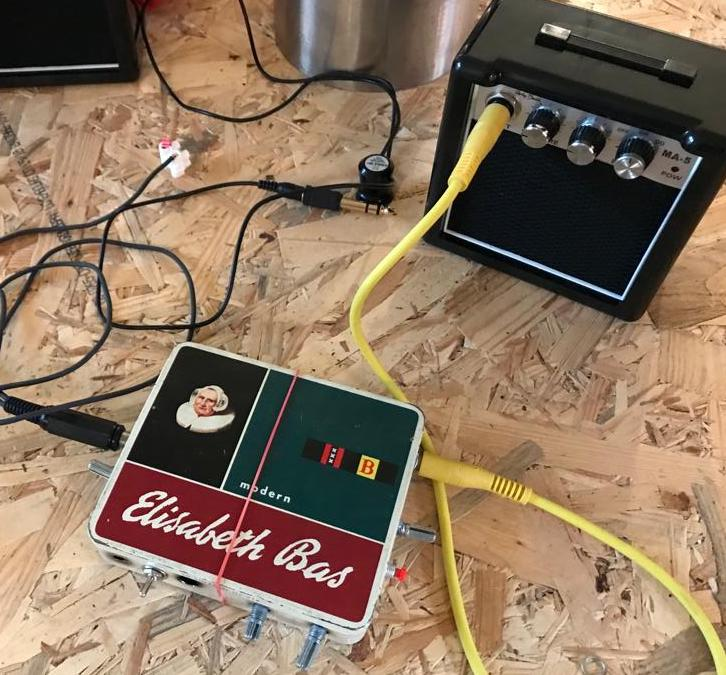 

### Wishlist based on workshop

* ~~rising/fallingEdge function not great fit w toggle switch, change to simple digitalRead~~
* find out how to protect line in
* ~~more descriptive serial output for the effect sketches (DONE)~~
* ~~controlling line in level w knob doesnt seem to work? (FIXED)~~
* ~~re-do wiring diagram (DONE)~~
* ~~write equalizer code for low pass, high pass, band pass filter (DONE)~~

## BOM 

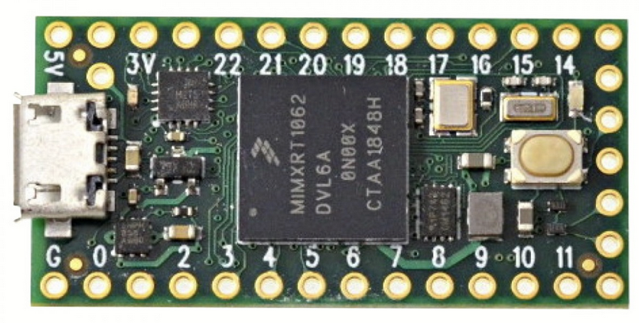 
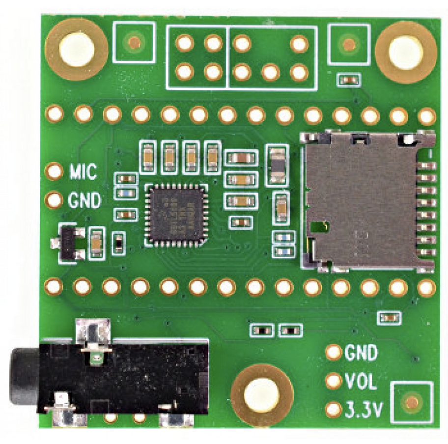 

* [Teensy 4.0 - without headers](https://www.tinytronics.nl/shop/en/development-boards/microcontroller-boards/teensy/teensy-4.0) € 27,50 via TinyTronics or Open Circuit
* [Teensy Audio Adapter Board for Teensy 4.0](https://www.tinytronics.nl/shop/en/development-boards/accessories/adapter-boards/teensy-audio-adapter-board-for-teensy-4.0) € 16,25 via TinyTronics or Open Circuit
* [Male pin header, 2x 14 positions](https://www.tinytronics.nl/shop/en/cables-and-connectors/connectors/pin-headers/male/40-pins-header-male) € 0,50 via TinyTronics
* [Breakaway male header 90 degrees](https://www.tinytronics.nl/shop/en/cables-and-connectors/connectors/pin-headers/male/40-pins-header-male-90-degrees) € 0,50 via TinyTronics 
* [Female header 11 mm pin height, scored and broken into 2 rows of 14 positions](https://www.tinytronics.nl/shop/en/cables-and-connectors/connectors/pin-headers/female/40-pins-header-female-11mm-pin-height) € 1 via TinyTronics
* [Micro USB cable](https://www.tinytronics.nl/shop/en/cables-and-connectors/cables-and-adapters/usb/micro-usb/micro-usb-cable-50cm) € 1,24 via TinyTronics
* 4x [10k potentiometer, breadboard compatible](https://www.tinytronics.nl/shop/en/components/resistors/potentiometers/10k%CF%89-potmeter-standard) € 0,41 each via TinyTronics
* Dupont jumper wires, male-male and male-female
* 2x[Jack chassis 6.3 mm](https://www.allekabels.nl/jack-stekker/42/1307777/jack-chassisdeel.html) € 0,99 alle kabels
* [6,3 mm jack patch cables, set](https://www.conrad.nl/nl/p/paccs-jack-kabel-6x-jackplug-male-6-3-mm-6x-jackplug-male-6-3-mm-30-00-cm-meerkleurig-301277.html) € 6.99 Conrad 
* battery-powered mini guitar amp with 6.3 mm jack line in/out [e.g.](https://www.thomannmusic.com/harley_benton_ma_5_miniamp.htm) € 15
* [Piezo transducers](https://www.tinytronics.nl/shop/en/audio/speakers/buzzers/piezo-electronic-buzzer-with-soldered-wires-35mm) € 0,41 Tinytronics
* Bicycle dynamos, second-hand/salvaged
* 2x[Solar cells 5V ](https://www.tinytronics.nl/shop/en/power/solar-energy/solar-panels/solar-panel-5v-200ma-110x80mm) € 2,89
* [Telephone pick-up mic](https://www.amazon.com/Telephone-Microphone-Suction-Cup-Pickup/dp/B0034I75IK) € 8
* [Terminal strip](https://www.tinytronics.nl/shop/en/cables-and-connectors/connectors/screw-terminals/terminal-strip-12-lanes) € 1,24 Tinytronics
* [Shielded audio cable](https://www.conrad.nl/nl/p/bkl-electronic-1509008-audiokabel-1-x-0-22-mm-zwart-per-meter-457893.html) € 1,49 per meter, Conrad
* 4x [Solderable mono jack plugs 6.35 mm € 0,44](https://www.kabelshop.nl/Nedis-6-35-mm-jack-plug-Nedis-Mono-Mannelijk-CAVC23980BK-i15077-t9799.html)


**Plus:for version with breadboard**
* [Large breadboard](https://www.tinytronics.nl/shop/en/tools-and-mounting/prototyping-supplies/breadboards/breadboard-830-points) € 3,31 tinytronics
* A power bank (or plug USB cable into laptop or wall socket adapter)
* [momentary switch 12mm](https://www.tinytronics.nl/shop/en/switches/manual-switches/pcb-switches/tactile-pushbutton-switch-momentary-4pin-12*12*7.3mm) € 0,12 via tinytronics
* [cap for momentary switch 12 mm](https://www.tinytronics.nl/shop/en/components/knobs,-caps-and-covers/button-cap-for-tactile-pushbutton-switch-momentary-12x12x7.3mm-yellow) €0,12 via Tinytronics
* [toggle switch](https://www.tinytronics.nl/shop/en/switches/manual-switches/slide-switches/small-switch-for-pcb-or-breadboard) € 0,17 via tinytronics


**Plus: for version inside a case** 
* 1x [Momentary switch](https://www.tinytronics.nl/shop/en/switches/manual-switches/push-buttons-and-switches/black-button-7mm) € 0,41 each via TinyTronics
* 1x [toggle switch](https://www.tinytronics.nl/shop/en/switches/manual-switches/toggle-switches/standard-built-in-flip-switch-mts-102) € 0,60 via TinyTronics
* [LilyGO TTGO 18650 battery charging board](https://www.tinytronics.nl/shop/en/power/bms-and-chargers/li-ion-and-li-po/with-protection-circuit/lilygo-ttgo-t-bat-with-18650-battery-holder-cn3065) € 4,55 via tinytronics
* [18650 li-ion battery 3500mAh/10A](https://www.tinytronics.nl/shop/en/power/batteries/18650/lg-18650-li-ion-battery-3400mah-10a-inr18650-mj1) € 4,96 via Tinytronics
* [JST-PH compatibel connector, 2 pos](https://www.tinytronics.nl/shop/en/cables-and-connectors/cables-and-adapters/jst-compatible/jst-2.0mm-connector-with-cable-ph2.0-2-pins) € 0,33 via Tinytronics
* [perfboard 2.54 mm spacing with lanes/strips](https://www.tinytronics.nl/shop/en/tools-and-mounting/prototyping-supplies/experiment-pcbs/experiment-pcb-6.5cm*14.5cm-lanes) €1,65 via TinyTronics

# Sounds Around: Material Symmetries

There are lots of signals around us that can be be sonified and/or amplified. What goes up, must come down, what gives will receive. A speaker is a mic is a speaker, a motor is a generator is a motor. Silent signals, textures, movements, vibrations: all can be explored with these simple probes. Wire one up and find out: 

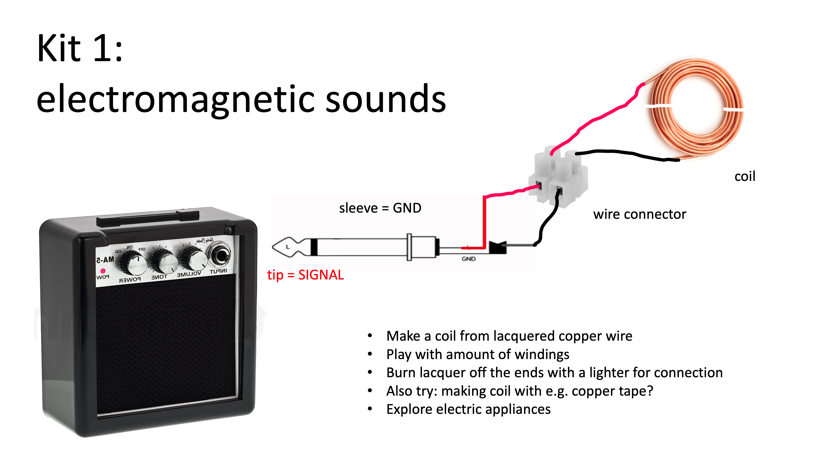 

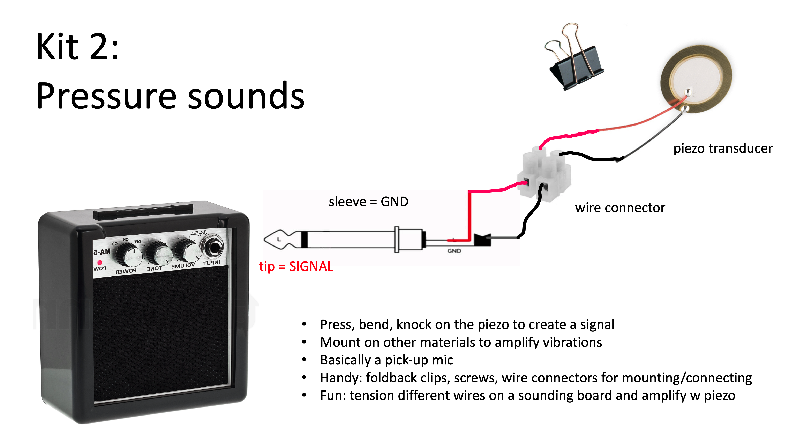 

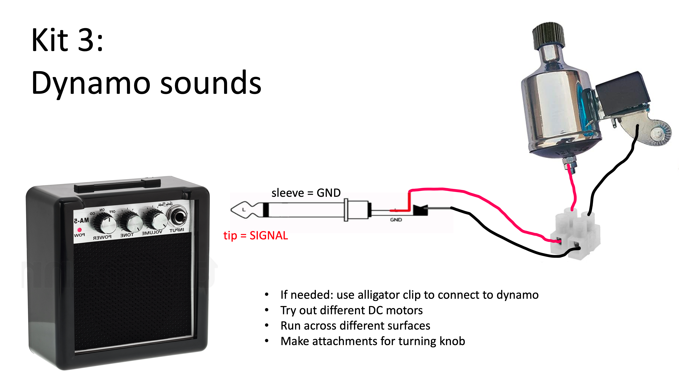 

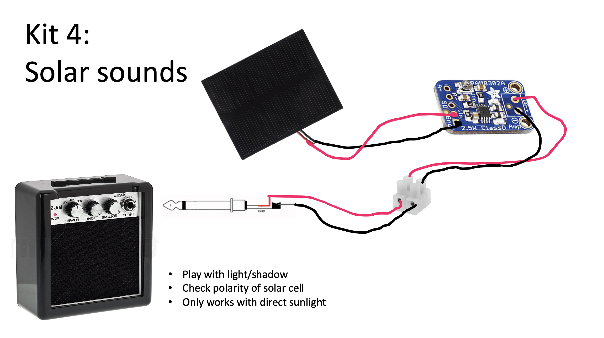 


# Building Sound Parasites

## Assembling the circuit

* Score the straight male and female header strips with a stanley knife or dremel and break them into rows of 14. 
* break two pieces from the 90 degree angled header: one with 2 positions and one with 3 positions. 


### Assembling with a breadboard

The teensy board will be pressed into the breadboard, the male pins of the female header should stick out of the bottom of the board. The audio shield will go on top of it, so needs the male header pins sticking out downwards also. So we want to: 

* Solder the female header strips with the long legs through the teensy board 
* solder the male header strips to the bottom of the audio shield
* solder the small angled headers to the line in and line out on the audio shield 


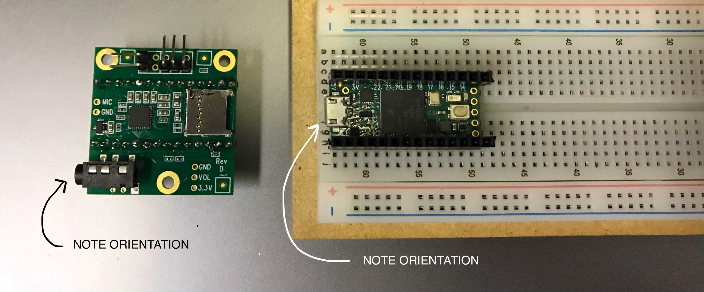 

* Gently press the header on top of the teensy board. Be careful not to bend the legs.

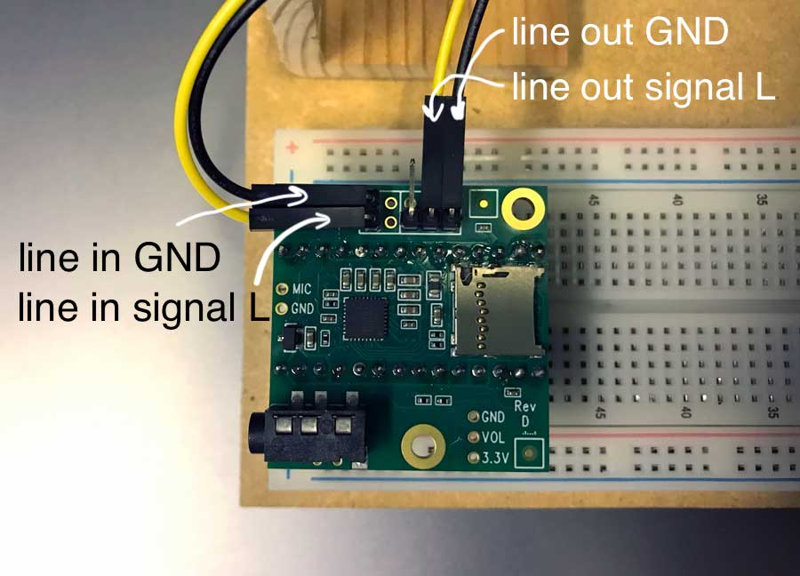 

* You can connect the left jack receptacle to the LINE IN pins (black to GND, yellow to SIGNAL L)
* And connect the right jack receptacle to the LINE OUT pins (black to GND, yellow to SIGNAL L)

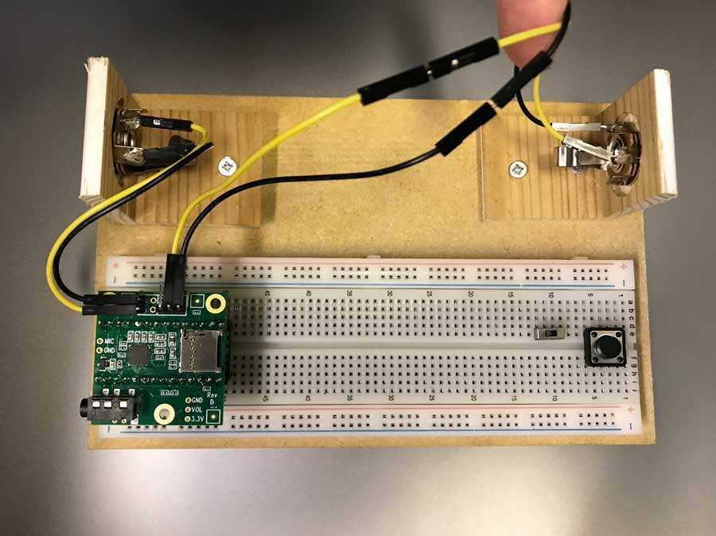 

* With this in place you can connect a probe (e.g. a piezo) as input on the line in (left), and a jack cable going to the speaker on the line out (right). 

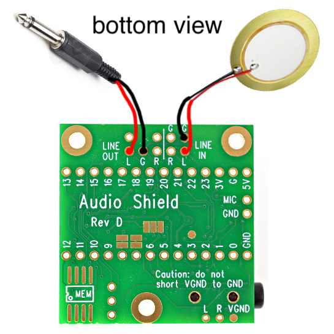 

**Breadboarding**

You will need to connect 4 potentiometers (turning knobs), a toggle switch, and a momentary switch to the breadboard. You can follow this wiring diagram. You might have a switch that looks slightly different. Just make sure to connect one leg to ground, and the other to the pin 0 (for a slide or toggle switch) or pin 1 for the momentary switch (pushbutton).

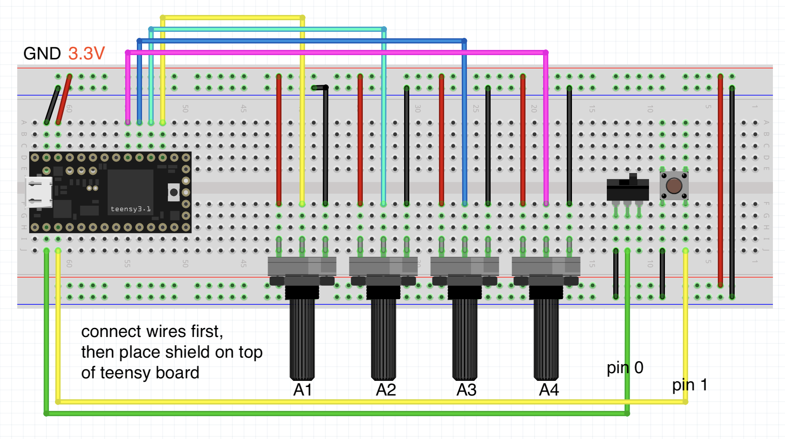 


### Assembling inside a box

This requires a slightly different approach because stacking the headers like we did for the breadboard makes the stack really high. So we will bend the stacking headers outwards to keep it more flat.

* bend the female headers with the long leg into a 90 degree angle: stick one into the holes of the board but not all the way (leave 1 mm to allow for bending) and bend them to 90 degree angle.  
* solder them to the teensy board
* solder the straight male header strips to the audio shield
* solder the small angled headers to the line in and line out on the audio shield

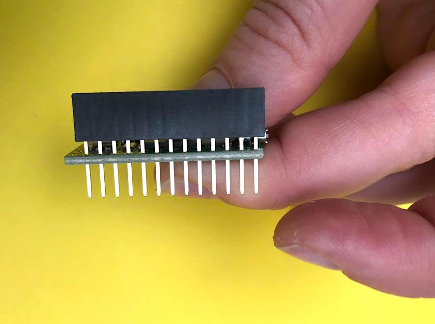 
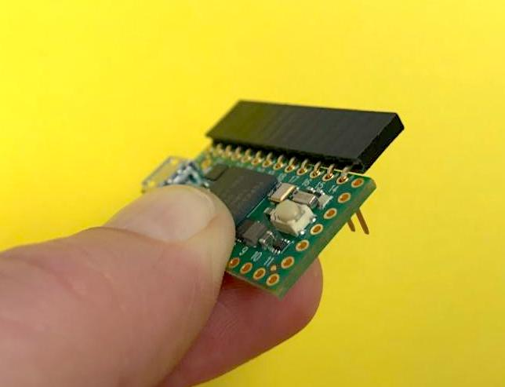 
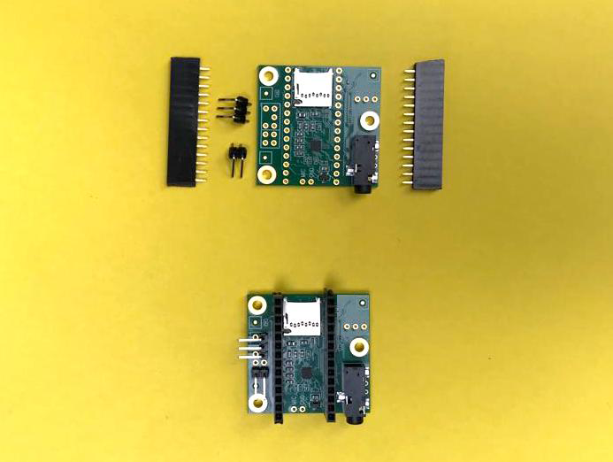 
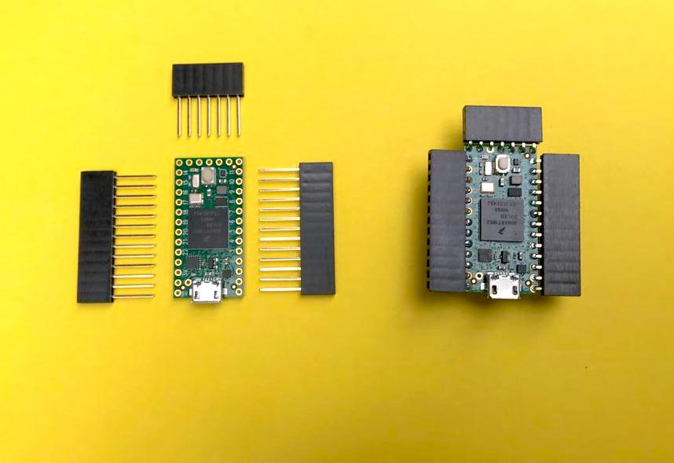 


## Install for Mac & Arduino 2.2.x.

Add link below to the JSON board manager URL in the preference panel of Arduino IDE: 

```
https://www.pjrc.com/teensy/package_teensy_index.json
```

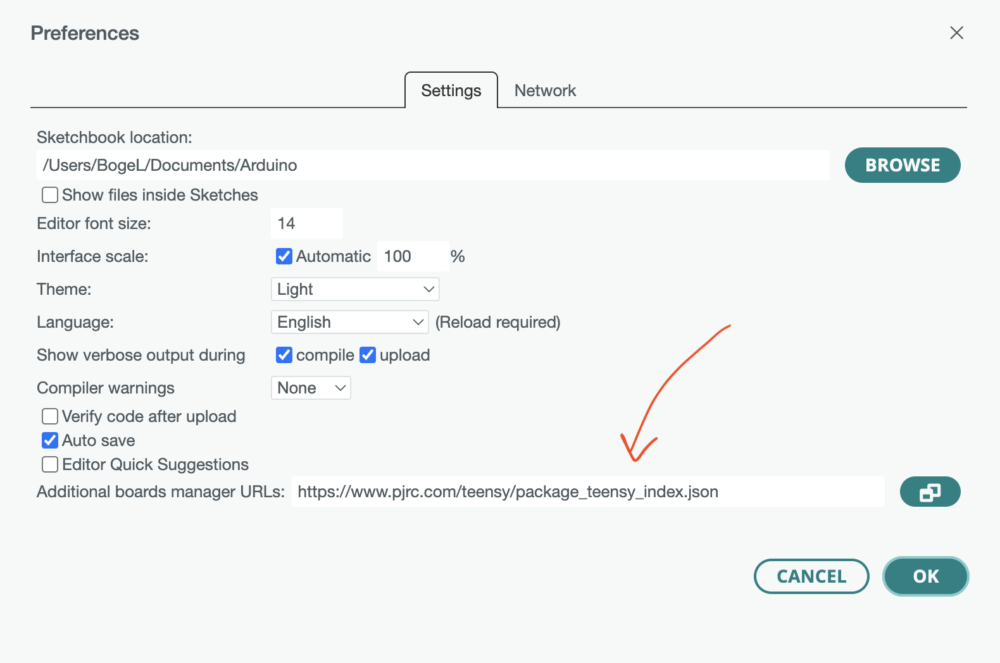 


Then install via > Tools > Boards > Boards Manager (search for "Teensy")

Installing separate Teensy Loader is not necessary, it comes with board install. 

More info on other OS: [https://www.pjrc.com/teensy/td_download.html](https://www.pjrc.com/teensy/td_download.html)

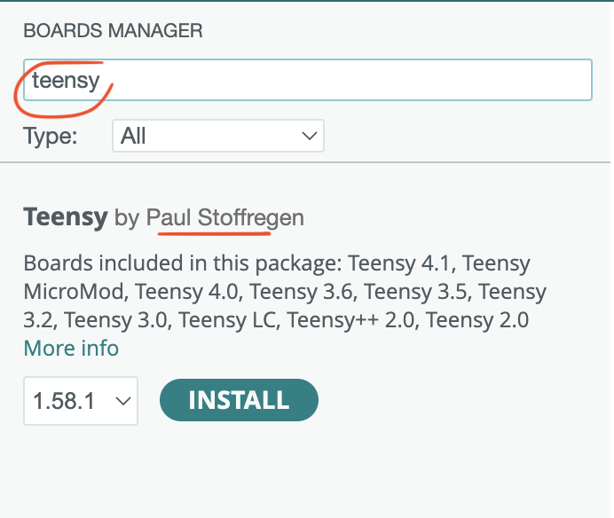 


### Choosing board & port

**Board**

Choose Teensy 4.0 from board menu under > Tools > Board

**Port**

When plugged in, a section called "Teensy Ports" shows up under > Tools > Port. On mac the port looks something like */dev/cu.usbmodemxxxxxxx Serial (Teensy 4.0)*

There might sometimes be some hassle with ports, then hit boot button on the teensy board and try again. Check the monitor for errors and hints on how to trouble shoot.


## Hardware test

First we want to check if all the hardware is wired correctly and working. Open the "hardware_test" from the code folder in this repository and upload it to the board (you can find it in the menu under > Sketch > Upload). 

1. Is the teensy chip programmed and live?
> if an LED on the board is blinking it means the board is powered and working!

2. Is the line out to the speaker functioning? 
> If you hear a beep every other second, your line out works!

3. Is the line in (probe to board) functioning? 
> if you touch the piezo disk connected to the line in, you should hear its sounds amplified through the speaker. 

3. Is the Teensy able to communicate with your computer? 
>  Open the serial monitor (in the menu under > Tools > Serial Monitor)
> Select teensy in the "Serial" section under > Tools > Port)
> Note: you need to switch between ports everytime when switching between uploading and using the serial monitor
> If you see numbers appearing continuously, the Teensy can communicate with the computer!

4. Are the knobs and switches wired correctly?
> Turn one of the knobs: if the numbers change (between 0-1023) as you turn, this knob is working correctly!
> Try the same for the other knobs
> Try the switches, if you press them or slide/toggle them the serial monitor should alternate between 0s and 1s (for voltage LOW or HIGH)

ALL SYSTEMS GO! Let's look at the code.

## Audio system design tool 

The hardware test defines a the audio elements above the setup. This is generated with a special Teensy Design system with a node based GUI. Copy paste these elements from the code and import them into the design tool with the IMPORT button. It will show you which elements are in the design and allows you to look up parameters of the different functions. This is useful if you want to change the code later: it tells you what is possible with these libraries.

[https://www.pjrc.com/teensy/gui/index.html](https://www.pjrc.com/teensy/gui/index.html)

Open in **SAFARI**! In Firefox you can drag and drop but not delete things.

You can import the code from Arduino to look at the nodes and connections: 

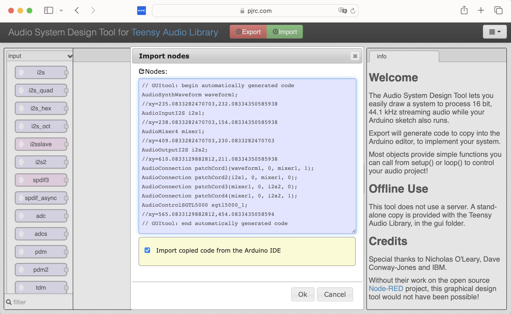 
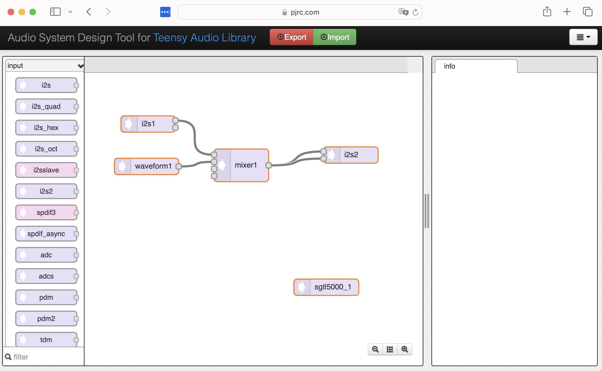 

Or you can create your own nodes and connections and export it with the EXPORT button. Then you copy these settings into your Arduino sketch (should be above the setup() function).


## Our sound parasites

Now we verified that everything works we can upload the code for the sound parasites. There's two types: one with echo (delay) and one with a granular effect/pitchshifting. Both have a reverb switch programmed in as well. 


### Pitch shift

If you look in the code, you can see that we commented what everything does. Here's an overview as well: 

- Pot 1 - A1 -> Input gain
- Pot 2 - A2 -> Granular pitchShift grainLength
- Pot 3 - A3 -> Granular speed ratio
- Pot 4 - A4 -> Reverb time
- Btn 1 - D0 -> Toggle - effects on/off
- Btn 2 - D1 -> Momentary switch - reverb on/off

### Echo

- Pot 1 - A1 -> gain line in
- Pot 2 - A2 -> delay time
- Pot 3 - A3 -> decay
- Pot 4 - A4 -> Reverb time
- Btn 1 - D0 -> Toggle - effects on/off
- Btn 2 - D1 -> Momentary switch - reverb on/off


## Teensy pinout

Below is the pinout of the Teensy 4.0. You can see there's a built-in LED on pin13, and pins 14-23 can also be used as analog pins (A0-A9). The pins marked with PWM can be used for analog writing to outputs (e.g. fading LEDs or spinning motors faster and slower).

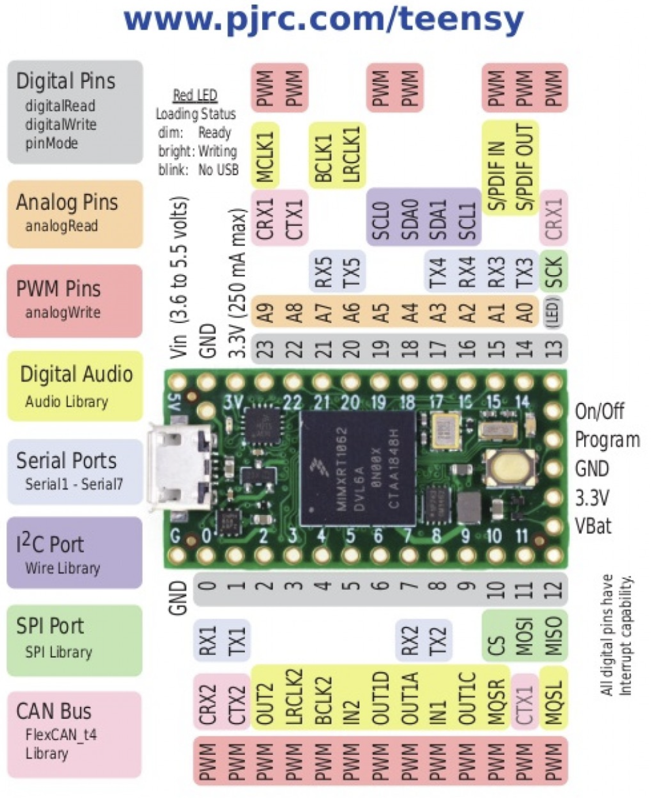 

## Note on recording and playback (not used here)

With the record example you can make a recording either with the mix or with the line in on the board. It generates a .raw file that you can import into Audacity and convert into something else. It overwrites the file every time you record and recording time is 9-s	10 secs or so


## Today's workshop outline

Check it out here: 

[https://etherpad.hackersanddesigners.nl/p/HackedOrchestra_13Oct](https://etherpad.hackersanddesigners.nl/p/HackedOrchestra_13Oct)

## Kids workshop outline

[https://etherpad.hackersanddesigners.nl/p/HackedOrchestra_7Oct](https://etherpad.hackersanddesigners.nl/p/HackedOrchestra_7Oct)
